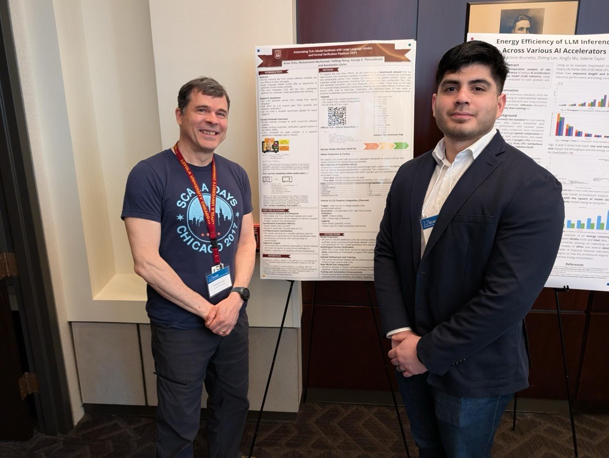

:blogpost: true
:date: May 8, 2025
:category: Research Update
:tags: Formal Methods, TLA+, LLMs, GCASR
:nocomments:

Brian Ortiz Presents Poster at GCASR 2025
==========================================

Brian Ortiz presented a work-in-progress poster at the 12th Greater Chicago Area
Systems Research Workshop (GCASR 2025), held on May 8, 2025 at Loyola University
Chicago's Water Tower Campus.

The poster, co-authored with Mohammed Abuhamad, TaiNing Wang, George K. Thiruvathukal,
and Konstantin Läufer, presents an automated pipeline for synthesizing TLA+ specifications
from natural language using large language models, validated with the SANY parser and
TLC model checker.

   Brian Ortiz standing with Konstantin Läufer next to their poster at GCASR 2025, Loyola University Chicago.

`Read the full paper details <../../papers/gcasr-2025-tla-llm/>`__
