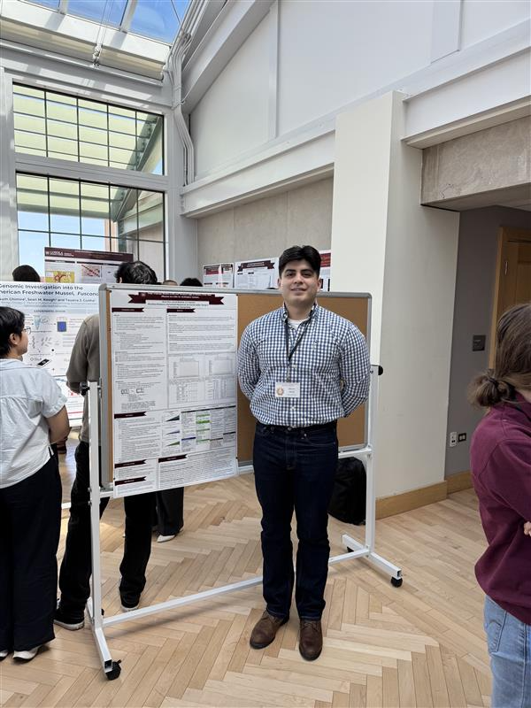

:blogpost: true
:date: April 11, 2026
:category: Research Update
:tags: Formal Methods, TLA+, LLMs, GSIRS
:nocomments:

Brian Ortiz Presents Poster at Graduate School Interdisciplinary Research Symposium 2026
=========================================================================================

Brian Ortiz presented a poster at the Graduate School Interdisciplinary Research Symposium
(GSIRS 2026) on April 11, 2026, at Loyola University Chicago.

The poster, co-authored with Arslan Bisharat, Mohammed Abuhamad, Konstantin Läufer,
Eric Spencer, Khushboo Bhadauria, George K. Thiruvathukal, and TaiNing Wang, presents
the first systematic evaluation of LLM-based TLA+ specification synthesis from natural
language. The study evaluates 30 LLMs across eight families on a curated dataset of 205
TLA+ specifications, finding that LLMs achieve up to 26.6% syntactic correctness but
only 8.6% semantic correctness. Model size does not reliably predict performance on
formal languages.

   Brian Ortiz standing next to his poster at the Graduate School Interdisciplinary Research Symposium 2026, Loyola University Chicago.

This poster is based on the paper `Can LLMs Write Correct TLA+ Specifications? Our New Evaluation Study <../posts/llm-tla-evaluation-2025/>`__, currently under submission.

`View the poster on figshare <https://doi.org/10.6084/m9.figshare.31988706>`__

`Read the full paper details <../papers/llm-tla-evaluation/>`__
